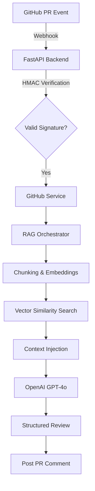

# AI Code Review Assistant

**Production-Ready RAG-Based GitHub Pull Request Automation**

---

### 🌐 Live Deployment
- **Review Dashboard**: [ai-code-review-assistant-ggw8.onrender.com](https://ai-code-review-assistant-ggw8.onrender.com/)

---

## Overview

**AI Code Review Assistant** is a production-oriented backend system that automates GitHub pull request reviews using a modular **Retrieval-Augmented Generation (RAG)** pipeline.

Instead of sending entire repositories to an LLM, the system:
- **Chunks** repository files
- **Generates** semantic embeddings
- **Retrieves** only relevant context
- **Injects** focused snippets into structured prompts

This approach improves token efficiency, accuracy, and scalability. The system integrates directly with GitHub Webhooks and posts structured review comments in real time.

---

## Core Capabilities

- **Automated Pull Request Analysis**: Real-time feedback triggered by GitHub Webhooks.
- **Repository-Wide Semantic Understanding**: Context-aware analysis via custom RAG.
- **Structured Feedback**: Findings categorized into Summary, Risks, and Suggestions.
- **HMAC-SHA256 Verification**: Cryptographic validation of all incoming GitHub events.
- **Firebase JWT Authentication**: Secure user sessions for the review dashboard.
- **Rate Limiting & Quotas**: Configurable limits to prevent API abuse and cost overruns.
- **Docker-Based Containerization**: Ready for high-availability deployment on Render or Kubernetes.
- **Observability**: Request ID tracing and detailed audit logging.

---

## Architecture

### System Flow


The architecture separates the **API layer**, **Security controls**, and the **Retrieval pipeline**. This modular structure allows independent evolution of ingestion, embedding, and review logic.

---

## Screenshots

### Dashboard Interface
Clean, developer-focused dashboard with structured review output and collapsible feedback sections.


### GitHub Pull Request Review Comment
Automated PR feedback posted directly to the GitHub discussion thread with categorized findings.
*Real webhook-triggered review generated using contextual RAG retrieval and GPT-4o.*


### RAG-Based Structured Output
Example structured output showing Summary, Risks, and Suggestions sections generated from contextual retrieval.


---

## Engineering Decisions & Design Rationale

### Why RAG Instead of Naive Prompting?
Sending full repositories to an LLM is expensive, slow, and constrained by context window limits. RAG retrieves only semantically relevant chunks, reducing token usage and improving precision.

### Why HMAC Verification?
GitHub Webhooks are externally triggered. Without signature verification, attackers could spam LLM calls or trigger "denial-of-wallet" attacks. HMAC verification ensures only GitHub-originated events are processed.

### Abuse Prevention Strategy
The system enforces strict:
- **Maximum file count** (Default: 50)
- **Maximum file size** (Default: 500KB)
- **Maximum repository size** (Default: 2MB)
- **Requests per minute** (Configurable Rate Limiting)
These controls prevent excessive token consumption and protect infrastructure costs.

### Container Security
The application runs as a **non-root user** with environment-based secret injection and strict CORS enforcement, adhering to the principle of least privilege.

---

## Tech Stack

- **Backend**: FastAPI, Pydantic
- **AI Layer**: OpenAI GPT-4o, Sentence-Transformers (`all-MiniLM-L6-v2`), NumPy
- **Security**: Firebase Admin SDK, HMAC-SHA256
- **Infrastructure**: Docker, Render, GitHub Webhooks

---

## Project Structure

```text
ai-code-review-assistant/
├── app/                  # Application Layer
│   ├── api/              # FastAPI Routes & Webhooks
│   ├── core/             # Security, Logging, Config
│   └── services/         # RAG, Ingestion, Reviewer
├── docs/                 # Documentation & Screenshots
├── frontend/             # Review Dashboard UI
├── k8s/                  # Kubernetes Manifests
├── tests/                # Unit & Integration Tests
├── Dockerfile            # Production Container Config
├── requirements.txt      # Dependency Manifest
└── README.md             # Project Master Info
```

---

## Local Development

1. **Clone and Install**:
```bash
git clone https://github.com/yourusername/ai-code-review-assistant.git
cd ai-code-review-assistant
python -m venv venv
source venv/bin/activate  # venv\Scripts\activate on Windows
pip install -r requirements.txt
```

2. **Configuration**:
Copy `.env.example` to `.env` and fill in your credentials.

3. **Run**:
```bash
export SKIP_AUTH=true  # $env:SKIP_AUTH="true" on Windows
uvicorn app.main:app --reload
```

---

## Deployment
This project is optimized for Docker-based deployment on **Render** or **Kubernetes**. Refer to [docs/DEPLOYMENT.md](docs/DEPLOYMENT.md) for full setup, including secret mounting and webhook configuration.

---

## Future Enhancements
- Persistent vector database (FAISS / pgvector) integration.
- Worker queue (Celery/Redis) for decoupled async processing.
- Multi-repository indexing for better cross-file context.
- OpenTelemetry integration for distributed tracing.

---

## What This Project Demonstrates
- Designing a modular RAG system for high-fidelity code analysis.
- Building secure, production-grade webhook backends.
- Implementing robust abuse prevention and cost controls in AI systems.
- Architecture for scalability and maintainable "Clean Code" structures.
