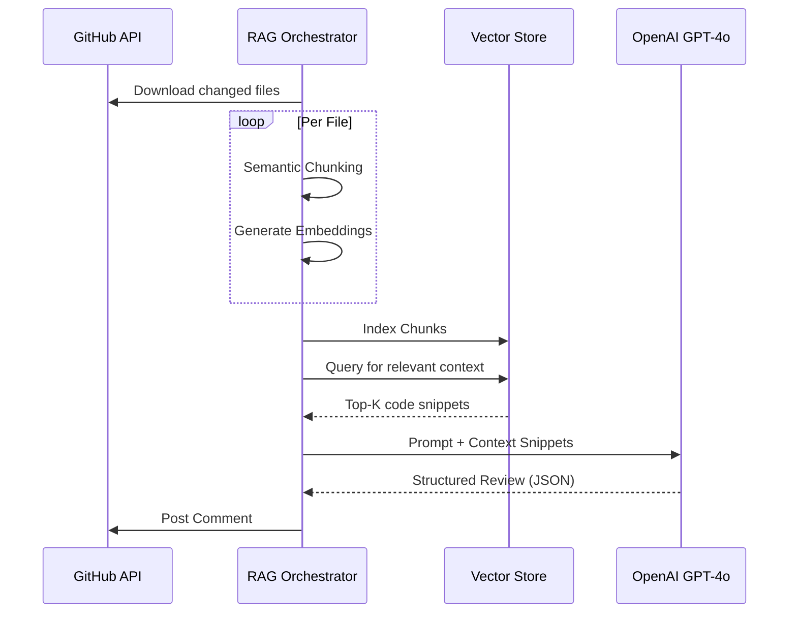

# System Architecture

## Architecture Overview

The AI Code Review Assistant is built on a modular RAG (Retrieval-Augmented Generation) architecture. This approach allows the system to analyze large repositories without exceeding LLM context limits by retrieving only the most relevant code sections for a specific review request.

### Core Modules

1.  **FastAPI Entrypoint**: Manages routing, rate limiting, and CORS.
2.  **GitHub Service**: Handles all communications with the GitHub API (fetching diffs, posting comments).
3.  **RAG Orchestrator**: The central controller that manages the flow between data ingestion and AI analysis.
4.  **Embedding Service**: Uses `all-MiniLM-L6-v2` to transform code chunks into 384-dimensional vectors.
5.  **Vector Store**: An in-memory implementation using NumPy for high-performance cosine similarity searches.
6.  **Reviewer Service**: Manages prompt engineering and OpenAI API communication.

## Retrieval-Augmented Generation (RAG) Lifecycle

### 1. Ingestion & Chunking
Code is downloaded into a temporary directory and broken into semantic chunks (e.g., functions, classes). This ensures that the AI receives logical sections of code rather than arbitrary line fragments.

### 2. Semantic Search
User queries or automated review prompts are embedded into the same vector space as the code chunks. We retrieve the `Top-K` chunks that are mathematically most similar to the query.

### 3. LLM Analysis
The retrieved chunks are injected into a specialized "System Prompt" that instructs the model to act as a Senior Engineer. The model returns a structured JSON object containing a summary, identified risks, and suggestions.

## Webhook Event Lifecycle

The automated review flow is triggered by GitHub `pull_request` events.

1.  **Ingress**: Payload received via `POST /github/webhook`.
2.  **Authentication**: HMAC signature verified against the `GITHUB_WEBHOOK_SECRET`.
3.  **Filtration**: The system ignores events other than `opened` or `synchronize`.
4.  **Processing**: The RAG pipeline is triggered asynchronously.
5.  **Egress**: Final review is posted as a single detailed comment on the PR.

## Scalability and Future Considerations

-   **Persistent Embeddings**: While currently in-memory for simplicity, the system can be scaled by integrating a persistent vector database like Pinecone or Weaviate.
-   **Task Queues**: For extremely large repositories, the webhook handler should offload the RAG pipeline to a celery worker to return a fast `202 Accepted` to GitHub.
-   **Distributed Tracing**: The existing `X-Request-ID` logic is designed to be fully compatible with OpenTelemetry for distributed tracing across multiple services.
